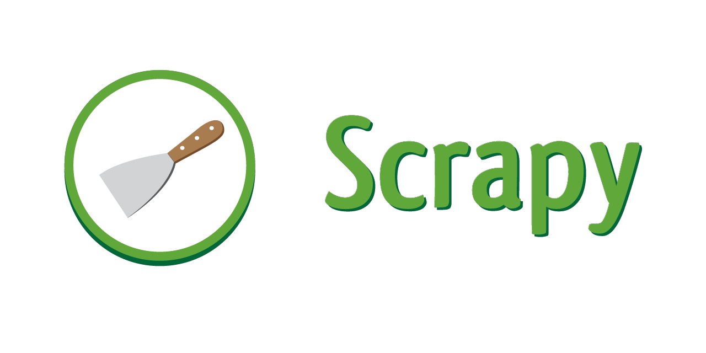
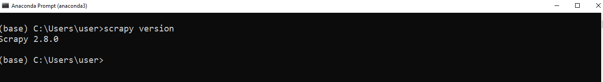
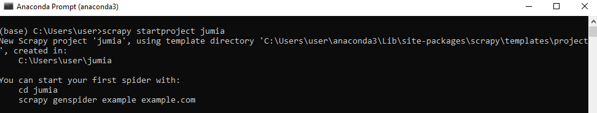
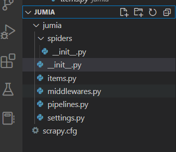
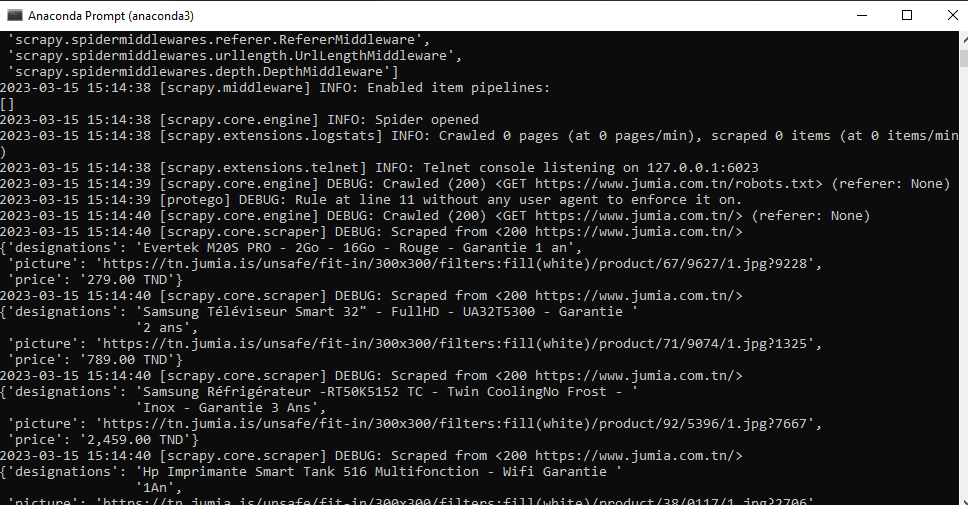
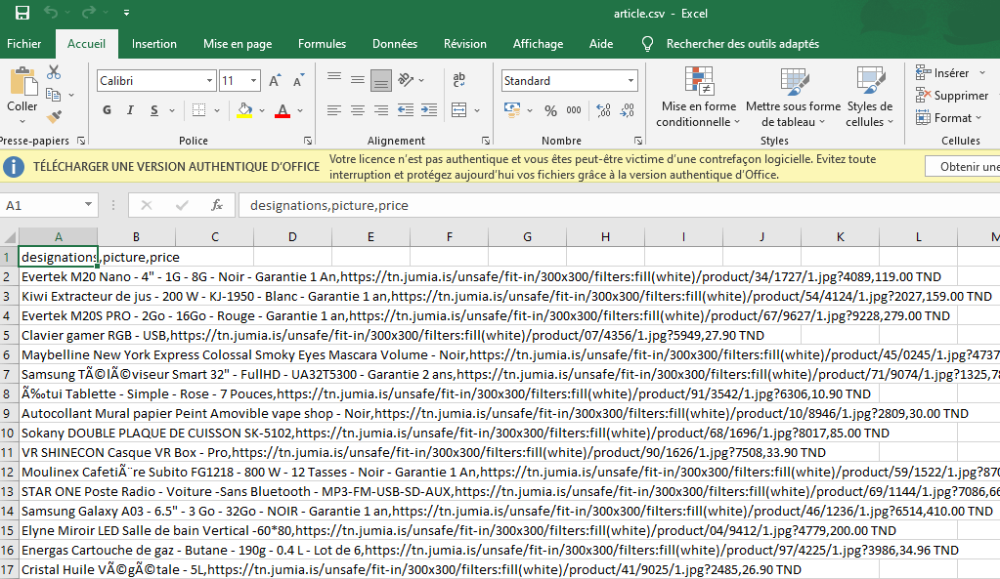
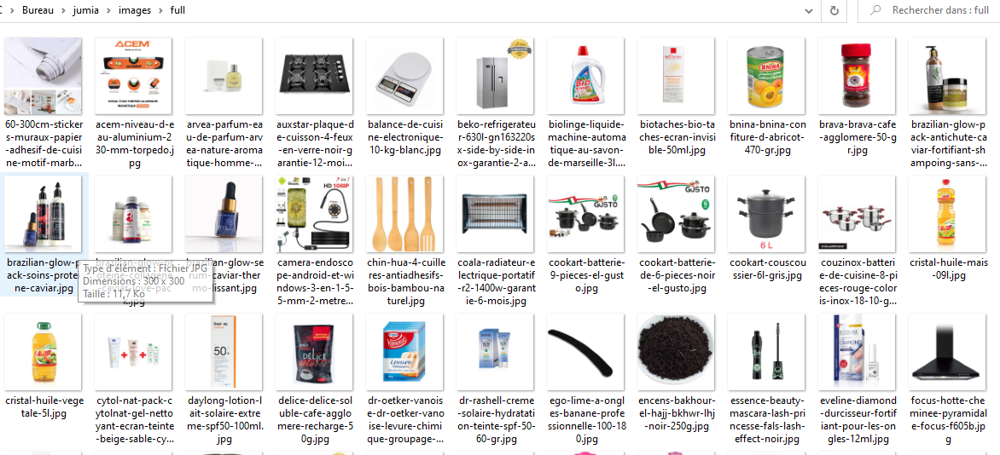

\newpage



# Scrapy
[Scrapy][1] is an [open source][2] Python framework used for extracting data from websites. It is very useful for collecting data at a large scale, automating scraping tasks, and performing data analysis.
# Why use scrapy?
Scrapy is a fast high-level [web crawling][3] and [Web scraping][4] framework, used to crawl websites and extract structured data from their pages.
# Installing Scrapy
There are [different ways ][5] to install scrapy. The easiest option is to install the [Anaconda][6] distribution. You can also install Scrapy  using pip or conda.
# Checking the installation
To check if Scrapy is properly installed on your system, you can execute the following command in your terminal:
```plaintext
scrapy version
```
This should display the version of Scrapy installed on your system. If Scrapy is installed correctly, you should see an output similar to this:



# 1.  Using Scrapy 
##### Command-line interface overview

  Scrapy's [command-line][7] interface is used to execute Scrapy commands to create new projects, run spiders to extract data, and more.
##### Creating a new project
  To create a new Scrapy project, you can use :
```python
 scrapy startproject project_name
```
command in Scrapy's command-line interface .For exemple :


# 2. Structure of a Scrapy project 
In our case, here is the structure of our Jumia project.


* #####   spiders  

 The [spiders][8] stored in a folder named "spiders" are Python classes that define how to extract data from a website.
 
```python
from import scrapy , spider
class Myspider(scrapy):
    name="myspider"
    start_urls=["http://www.example.com"]
    # Extract data from the response
    def parse(self,reponse):
        title=reponse.css("title::text").get()
    # Yield an item containing the extracted data
        yield {"title": title}
```
In this example, MySpider is a spider that extracts the title of a webpage and stores the result in an item object.
* 
* ##### __init__.py
file can be empty, or it can contain Python code that needs to be executed when the package is imported. It can contain class definitions, functions, variables, constants, module imports, and so on.
* #####  items.py
[Items][9] are containers that store the data extracted by the spiders.
```python
import scrapy
class MyItem(scrapy.Item):
     title = scrapy.Field()
     description = scrapy.Field()
```
In this example, MyItem is an item object that contains title and description fields to store data extracted by a spider.
* #####  Middleware.py
[Middleware][10] are Python classes that provide additional functionality to Scrapy, such as filtering requests or processing responses.
```python
class CustomMiddleware:
    def process_request(self, request, spider):
        # Modify the request before it is sent
        request.headers["User-Agent"] = "Mozilla/5.0 (Windows NT 10.0; Win64; x64) AppleWebKit/537.36 (KHTML, like Gecko) Chrome/58.0.3029.110 Safari/537.36"

    def process_response(self, request, response, spider):
        # Modify the response before it is returned to the spider
        if response.status == 404:
            return scrapy.Request("http://www.example.com", callback=spider.parse_error)
        else:
            return response
```
In this example, CustomMiddleware is a class that modifies requests and responses by adding a custom User-Agent header to requests and checking the response status code. If the status code is 404, the middleware sends a new request to another page.
* ##### Pipelines.py
 [Pipelines][11] are Python classes that handle the data extracted by the spiders.
 ```python
import json
class MyPipeline:
    def __init__(self):
        self.file = open("data.json", "w")

    def process_item(self, item, spider):
        # Write the item to a JSON file
        line = json.dumps(dict(item)) + "\n"
        self.file.write(line)
        return item

    def close_spider(self, spider):
        # Close the file when the spider is done
        self.file.close()
```
In this example, MyPipeline is a class that stores the data extracted by a spider in a JSON file. The process_item method is called for each extracted item, which is then written to the file. The close_spider method is called when the spider has finished its work, and it closes the file.
* ##### Settings.py
[Settings][12] are configuration variables that define the behavior of Scrapy.
```python
BOT_NAME = "mybot"
USER_AGENT = "Mozilla/5.0 (Windows NT 10.0; Win64; x64) AppleWebKit/537.36 (KHTML, like Gecko) Chrome/58.0.3029.110 Safari/537.36"
ROBOTSTXT_OBEY = True
ITEM_PIPELINES = {"myproject.pipelines.MyPipeline": 300}
```
In this example, Scrapy settings are defined in a settings.py file. The bot name, User-Agent header used for requests, whether to obey the robots.txt file, and the pipeline used are all specified in this file.
* ##### Scrapy.cfg
This is the main configuration file for Scrapy. It contains information such as the project name, default settings, and spider locations.
# 3. Data extraction
In our case, we will extract data on the articles from the Jumia website (https://www.jumia.com.tn)
##### * Writing in Item.py
  ```python
import scrapy
class ArticleItem(scrapy.Item):
      # Definition of fields for the ArticleItem object
      # Field for article designations
      designations=scrapy.Field()
      # Field for article images
      picture=scrapy.Field()
      # Field for article prices
      price=scrapy.Field()

```
In this code, we retrieve the designation, image, and price of an article.
* ##### Creating a spider file in the spider folder
We will create a new file "article.py" in the spider folder. In this file, we will write our spider which is nothing but a class inheriting from the Scrapy spider class.
```python
# Import necessary modules
from scrapy import Request, Spider
from ..items import ArticleItem
from jumia import items

# Create a spider class
class SpiderArticle(Spider):
    # Define spider name
    name = "article"
    # Define the URL to scrape
    url = "https://www.jumia.com.tn/"

    # Define the starting point for the spider
    def start_requests(self):
        # Send a request to the URL and specify the callback function to use
        yield Request(url=self.url, callback=self.parse_article)

    # Define the callback function to extract data from the page
    def parse_article(self, response):
        # Find all the articles on the page
        listeArticle = response.css('article.prd')
        # Loop through each article and extract relevant data
        for article in listeArticle:
            # Extract the article's designation
            designations = article.css('a.core div.name::text').extract_first()
            # Extract the article's picture
            picture = article.css('a.core img.img').attrib['data-src']
            # Extract the article's price
            price = article.css('a.core div.prc::text').extract_first()
            # Create an ArticleItem instance and fill it with data
            item = ArticleItem()
            item['designations'] = designations
            item['picture'] = picture
            item['price'] = price

            # Yield the ArticleItem instance to Scrapy for further processing
            yield item
```
* #####  data recovery

```python
# This command runs the Scrapy spider called "article" to scrape data from the specified website.
scrapy crawl article
```
  the result of executing this code.
 
* ##### Storing data in an Excel file named article.csv 
```python
scrapy crawl article -o article.csv
```
the result of executing this code.

* ##### Displaying data with pandas.
```python
import pandas as pd 
df=pd.read_csv("article.csv")
df.head()
```
| Designations                                      | Picture                                           | Price      |
|---------------------------------------------------|---------------------------------------------------|------------|
| Evertek M20 Nano - 4" - 1G - 8G - Noir - Garan..  | https://tn.jumia.is/unsafe/fit-in/300x300/filt..  | 119.00 TN  |
| Kiwi Extracteur de jus - 200 W - KJ-1950 - Bla... | https://tn.jumia.is/unsafe/fit-in/300x300/filt.   | 159.00 TND |
| Evertek M20S PRO - 2Go - 16Go - Rouge - Garant.   | https://tn.jumia.is/unsafe/fit-in/300x300/filt... | 279.00 TND |
| Clavier gamer RGB - USB                           | https://tn.jumia.is/unsafe/fit-in/300x300/filt.   | 27.90 TND  |

#  4. Using pipelines 
* ##### Extracting images using pipelines.
```python
from itemadapter import ItemAdapter
from scrapy.pipelines.images import ImagesPipeline
from slugify import slugify
from scrapy import Request
import os

class CustomImagesPipeline(ImagesPipeline):
    # Pipeline for downloading images from article pages

    def get_media_requests(self, item, info):
       
        image_url = item['picture_url'] # use 'picture_url' instead of 'picture'
        yield Request(image_url)

    def file_path(self, request, response=None, info=None, *, item=None):
        # This method is called to determine the file name and path for the downloaded image
        # We use the 'designations' field from the ArticleItem object as the basis for the file name
        # We use the 'slugify' library to remove any characters that are not allowed in a file name
        # We limit the maximum length of the file name to 200 characters, to avoid issues with long names
        image_name = slugify(item.get('designations'), max_length=200)
        return f'full/{image_name}.jpg' # save the image to the 'full' subdirectory, with a .jpg extension
```
 This code allows us to retrieve and download images of our articles
* ##### Configuring our settings file to be able to run our pipelines 
```python
BOT_NAME = "jumia"

SPIDER_MODULES = ["jumia.spiders"]
NEWSPIDER_MODULE = "jumia.spiders"
ITEM_PIPELINES = {'jumia.pipelines.CustomImagesPipeline': 1 }

IMAGES_STORE = 'images'
# Obey robots.txt rules
ROBOTSTXT_OBEY = True

```

Updating the article.py file for image extraction.
```python
from scrapy import Request, Spider
from jumia.items import ArticleItem # import ArticleItem from the correct location
from scrapy import Request

class SpiderArticle(Spider):
    name = "article"
    url = "https://www.jumia.com.tn/"

    def start_requests(self):
        yield Request(url=self.url, callback=self.parse_article)

    def parse_article(self, response):
        # Get the list of articles
        listeArticle = response.css('article.prd')
        for article in listeArticle:
            # Get the article's designations, picture URL, and price
            designations = article.css('a.core div.name::text').extract_first()
            picture_url = article.css('a.core img.img').attrib['data-src']
            price = article.css('a.core div.prc::text').extract_first()
            
            # Create a new ArticleItem object and assign the scraped data to its fields
            item = ArticleItem()
            item['designations'] = designations
            item['picture'] = picture_url
            item['price'] = price
            item['picture_url'] = picture_url
            
            # Yield the item to pass it to the pipeline for further processing
            yield item

```
Updating the items.py file for image extraction.
```python
import scrapy


class ArticleItem(scrapy.Item):
    
      # Field for article designations
      designations=scrapy.Field()
      # Field for article images
      picture=scrapy.Field()
      # Field for article prices
      price=scrapy.Field()
      # Field for the URL of the article's picture
      picture_url = scrapy.Field()
```
Run our spider again:
```python
scrapy crawl article
```
Result of the execution.

# 5. Using pipelines for data transformation

```python
class CustomPricePipeline:
    # Pipeline to convert prices to euros
    exchange_rate = 0.31 # TND to EUR exchange rate
    def process_item(self, item, spider):
        # We assume the price is in TND and convert it to EUR
        tnd_price = item['price']
        if 'TND' in tnd_price: # Check if price is in TND
            tnd_price = tnd_price.replace('TND', '').strip() # Remove 'TND' currency symbol and any whitespace
            eur_price = round(float(tnd_price) * self.exchange_rate)
            item['price'] = f'{eur_price} EUR'
        return item
```
 This code converts prices to euros.
* ##### Updating the settings.py file to run this code.
```python
BOT_NAME = "jumia"

SPIDER_MODULES = ["jumia.spiders"]
NEWSPIDER_MODULE = "jumia.spiders"
ITEM_PIPELINES = {'jumia.pipelines.CustomImagesPipeline': 1 ,
                  'jumia.pipelines.CustomPricePipeline': 2 ,
                  
}

IMAGES_STORE = 'images'
ROBOTSTXT_OBEY = True
```
Here is the obtained result.


|                                                  |         |
|--------------------------------------------------|---------|
| Designations                                     | Price   |
| Evertek M20 Nano - 4" - 1G - 8G - Noir - Garan.. | 119 EUR |
| Kiwi Extracteur de jus - 200 W - KJ-1950 - Bla.  | 159 EUR |
| Evertek M20S PRO - 2Go - 16Go - Rouge - Garant.  | 279 EUR |

# 6. Uses of pipelines to process data.

```python
class CustomDesignationsPipeline:
    
    def process_item(self, item, spider):
        # Initialize an empty list to store the extracted words
        words = []
        
        # Loop through each designation in the 'designations' field of the item
        for designation in item['designations']:
            # Split the designation string at the '-' character and get the first element (i.e., the word)
            word = designation.split('-')[0].strip()
            # If the resulting word is not an empty string, append it to the 'words' list
            if word:
                words.append(word)
        
        # Join the words in the 'words' list into a single string, separated by spaces
        extracted_words = ' '.join(words)
        
        # Add the extracted words to the item dictionary
        item['extracted_words'] = extracted_words
        
        # Return the modified item
        return item
```
This code defines a custom pipeline class that extracts certain words from the designations field of each item processed by a spider. The extracted words are stored in a new field called extracted_words in the item dictionary.
* ##### Updating the settings.py file to run this code.
```python
BOT_NAME = "jumia"

SPIDER_MODULES = ["jumia.spiders"]
NEWSPIDER_MODULE = "jumia.spiders"
ITEM_PIPELINES = {'jumia.pipelines.CustomImagesPipeline': 1 ,
                  'jumia.pipelines.CustomPricePipeline': 2 ,
                   'jumia.pipelines.CustomDesignationsPipeline':3
}

IMAGES_STORE = 'images'
ROBOTSTXT_OBEY = True
```
Here is the result obtained.          

| Designations                                      | Extracted_words                                   |
|---------------------------------------------------|---------------------------------------------------|
| Samsung Téléviseur Smart 32" - FullHD - UA32T5    | S a m s u n g T é l é v i s e u r S m a r t 3  |
| Brazilian Glow Sérum Caviar Thermo-Lissant        | B r a z i l i a n G l o w S é r u m C a v i a   |
| Niken MINI COMPRESSEUR D AIR DE LA MARQUE NIKE... | N i k e n M I N I C O M P R E S S E U R D A I  |

# conclusion
Hoping that you have learned two or three things, know that the topic is much broader than it seems. It is therefore strongly recommended that you browse the following links to perfect your learning.
# To Learn more 
* Scrapy documentation: https://docs.scrapy.org/en/latest/
* Scrapy tutorial: https://docs.scrapy.org/en/latest/intro/tutorial.html
* Advanced Scrapy techniques: https://blog.scrapinghub.com/2016/07/07/scrapy-tips-from-the-pros-advanced-techniques/
* Scrapy vs. BeautifulSoup comparison: https://www.scrapingbee.com/blog/scrapy-vs-beautiful-soup/
* Scrapy and Splash tutorial: https://blog.scrapinghub.com/2015/03/02/handling-javascript-in-scrapy-with-splash/
* Scrapy and XPath tutoria: https://www.accordbox.com/blog/scrapy-tutorial-7-how-use-xpath-scrapy/
* Scrapy vs. Selenium comparison: https://medium.com/analytics-vidhya/scrapy-vs-selenium-vs-beautiful-soup-for-web-scraping-24008b6c87b8
* Scrapy architecture explained: https://docs.scrapy.org/en/latest/topics/architecture.html
# To go even further :
Scrapy is a powerful web scraping library, but it may not be suitable for handling extremely large datasets. When it comes to processing massive datasets, there are several alternatives to consider:
* [PySpider][13] : 
A powerful, open-source web crawling and web scraping framework that uses asyncio and Python's async/await syntax.
* [Apache Nutch][14]: An open-source web crawler that allows you to search and analyze web content.
* [StormCrawler][15]: An open-source collection of resources and tools for building scalable, distributed web crawlers.
* [Portia][16]: A web scraping tool that uses machine learning to help you extract data from websites without writing any code.

  [1]: https://docs.pyspider.org/en/latest/
  [2]: https://docs.pyspider.org/en/latest/
  [3]: https://docs.scrapy.org/en/latest/topics/item-pipeline.html
  [4]: https://docs.scrapy.org/en/latest/topics/item-pipeline.html
  [5]: https://docs.scrapy.org/en/latest/topics/item-pipeline.html
  [6]: https://docs.scrapy.org/en/latest/topics/item-pipeline.html
  [7]: https://docs.scrapy.org/en/latest/topics/item-pipeline.html
  [8]: https://docs.scrapy.org/en/latest/topics/item-pipeline.html
  [9]: https://docs.scrapy.org/en/latest/topics/item-pipeline.html
  [10]: https://docs.scrapy.org/en/latest/topics/item-pipeline.html
  [11]: https://docs.scrapy.org/en/latest/topics/item-pipeline.html
  [12]: https://docs.scrapy.org/en/latest/topics/settings.html
  [13]: https://docs.pyspider.org/en/latest/
  [14]: https://cwiki.apache.org/confluence/display/nutch/NutchTutorial
  [15]: https://medium.com/analytics-vidhya/web-scraping-and-indexing-with-stormcrawler-and-elasticsearch-a105cb9c02ca
  [16]: https://www.zyte.com/blog/announcing-portia/
